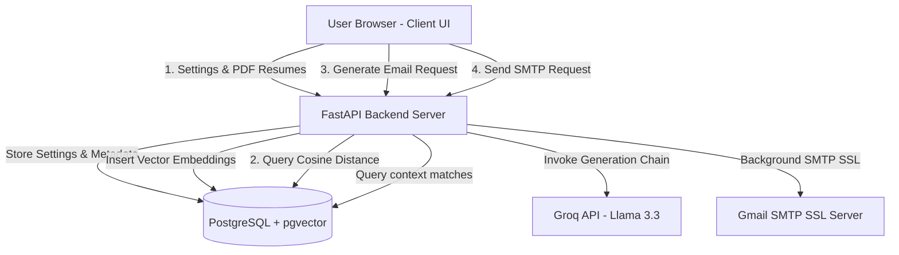
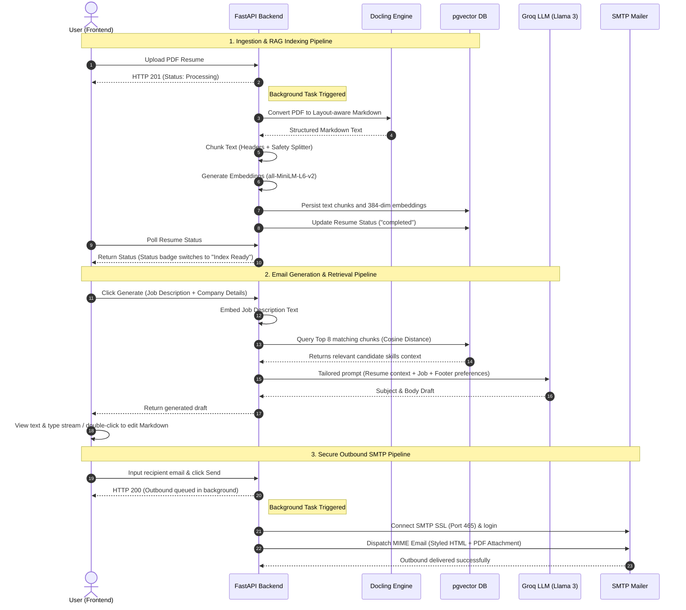

# ColdMail AI - Personalized Outbound Assistant

ColdMail AI is a modern, self-hosted web application that automates the generation of highly personalized, context-aware job application cold emails. Powered by layout-aware RAG (Retrieval-Augmented Generation), it parses multiple candidate resumes (e.g. AI stack, Backend stack, Fullstack), performs semantic search matching role requirements, and drafts outbound emails using Groq (Llama 3.3 70B) styled to the user's preferences. It also includes a background SMTP mailer for immediate dispatch with resume attachments.

---

## 🚀 Getting Started

Setting up the entire suite of services is fully automated using Docker.

### Prerequisites
* Docker installed on your host system.
* Docker Compose installed.

### Run via Docker Compose
Clone the repository and run the following command in the root folder:

```bash
# Spin up both PostgreSQL (pgvector) and FastAPI container services
docker-compose up -d --build
```

The application will be accessible at:
* **Frontend Web UI**: [http://localhost:8000](http://localhost:8000)
* **API Swagger Docs**: [http://localhost:8000/docs](http://localhost:8000/docs)

---

## 🛠️ Tech Stack Used

| Layer | Technology | Description |
| :--- | :--- | :--- |
| **Backend Framework** | FastAPI (Python 3.11) | High-performance, asynchronous REST API layer. |
| **Database** | PostgreSQL + pgvector | Relational data persistence with native vector similarity search. |
| **Document Processing** | Docling (by IBM) | Layout-aware document converter translating PDFs to structured Markdown. |
| **Embeddings Model** | Hugging Face (`all-MiniLM-L6-v2`) | Local execution of semantic text embedding generation (384-dim). |
| **LLM Orchestration** | LangChain & langchain-groq | Prompt templates and tool-calling execution. |
| **inference API** | Groq (Llama 3.3 70B Versatile) | Low-latency drafting engine using context-rich prompting. |
| **Email Parsing** | Marko | Parses markdown generated drafts into styled HTML MIME blocks. |
| **SMTP Delivery** | Python `smtplib` + SSL | Secure outbound transmission (port 465) with PDF attachment encoding. |
| **Frontend** | HTML5, CSS3, JavaScript | Lightweight SPA with typewriter stream simulation and markdown previews. |

---

## 📐 System Architecture

The following diagram illustrates how the frontend client, FastAPI backend, pgvector database, and external APIs communicate:



---

## 🔄 Pipeline Sequence Flowchart

The workflow of ingestion, indexing, retrieval, generation, and dispatch:



---

## 📂 Project Structure

```
AI-Powered-Cold-Email-Application-Assistant/
├── backend/
│   ├── assets/                 # Storage for physically uploaded PDFs
│   ├── controllers/            # Class-based business logic controllers
│   │   ├── email_controller.py # SMTP SSL queues & pgvector RAG logic
│   │   ├── resume_controller.py# PDF uploading & background processing triggers
│   │   └── settings_controller.py # Outbound profile settings CRUD
│   ├── database.py             # SQLAlchemy configuration, migrations & startup hooks
│   ├── doc_processing_engine.py# Docling PDF parsing & pgvector indexing
│   ├── Dockerfile              # Backend container build configuration
│   ├── email_service.py        # SMTP SSL dispatch and HTML MIME compilation
│   ├── llm_engine.py           # LangChain Groq prompt orchestration
│   ├── main.py                 # FastAPI application entrypoint & static mount
│   ├── models.py               # SQLAlchemy database models (Settings, Resumes, Chunks)
│   ├── requirements.txt        # Python dependency declarations
│   ├── routes.py               # Unified REST API endpoint routing
│   └── schemas.py              # Pydantic validation schemas
├── frontend/                   # Dashboard static files
│   ├── index.html              # Welcome screen, credentials form, and split-pane workspace
│   ├── script.js               # State manager, file drop listeners, and typewriter streams
│   └── style.css               # Variable-theme layout stylesheet (dark & light modes)
├── docker-compose.yml          # Container coordination configuration
└── readme.md                   # System documentation (this file)
```

---

## 📄 Module Descriptions

| Module | Purpose | Key Responsibilities |
| :--- | :--- | :--- |
| **`main.py`** | Entrypoint | Initializes FastAPI, triggers database migrations, mounts `/static` endpoints, and clears stuck processing tasks on reboot. |
| **`routes.py`** | Routing | Maps API endpoints (`/api/settings`, `/api/resumes`, `/api/generate`, `/api/send-email`) to their respective controller classes. |
| **`schemas.py`** | Validation | Defines Pydantic data schemas validating API payloads and database serialization limits. |
| **`models.py`** | Database Models | Outlines SQL tables for User Settings, Resume metadata, and pgvector Resume Embeddings (384 dimensions). |
| **`controllers/`** | Business Logic | Isolates endpoint interactions (Settings storage, Resume CRUD pipelines, and Outbound execution). |
| **`doc_processing_engine.py`** | Document Ingestion | Deferred loading of `Docling` to extract layout-aware markdown and `langchain` to generate vector embeddings. |
| **`llm_engine.py`** | RAG Generation | Invokes Llama 3.3 via Groq using matching resume chunks as context to write tailored cold emails. |
| **`email_service.py`** | SMTP Delivery | Preprocesses Markdown into left-aligned HTML paragraphs and dispatches emails with attachment encodings. |
| **`frontend/`** | Web Client UI | A 4-step responsive dashboard walkthrough (Welcome $\rightarrow$ Credentials setup $\rightarrow$ Resume Upload Drawer $\rightarrow$ Workspace Workspace). |
